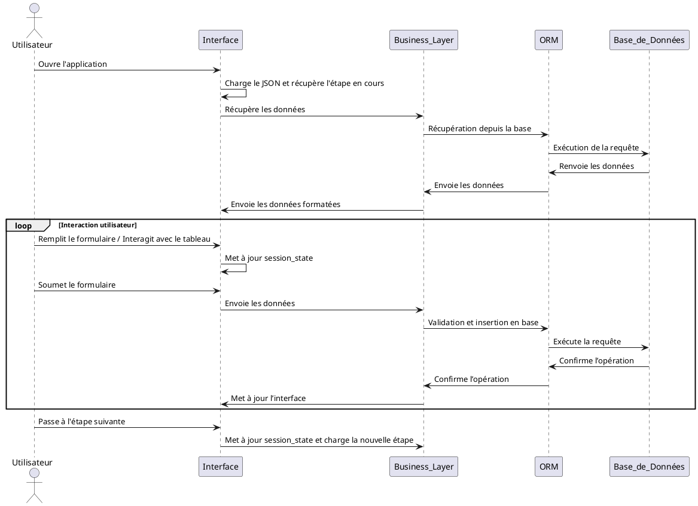
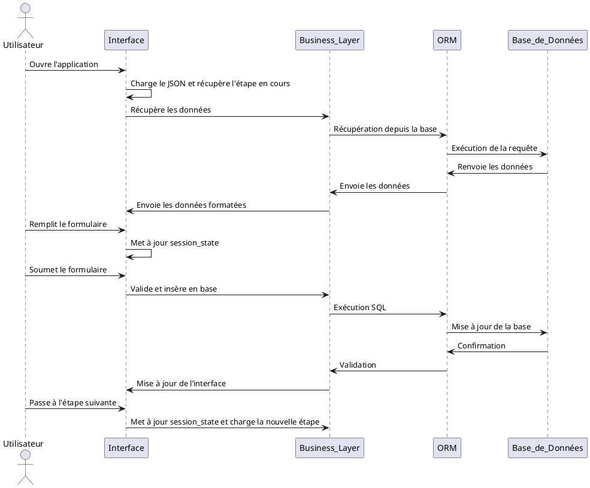
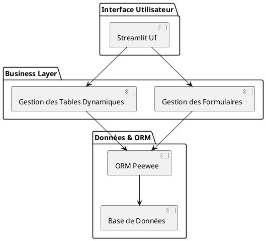

# 📌 Dossier Technique : Génération de Formulaires Dynamiques et Tableaux Associés

## 📖 Sommaire
1. **Contexte du Projet**
2. **Objectif : Interfaces Dynamiques**
3. **Architecture du Projet**
4. **Workflow des Étapes**
5. **Affichage des Interfaces**
6. **Modèle JSON Détaillé et Options Avancées**
7. **Navigation et Gestion des Étapes**
8. **Schéma d’Architecture**
9. **Refactoring du Code et Nommage**
10. **Contraintes du Modèle Générique et Personnalisation**


## 1️⃣ **Contexte du projet**
L’objectif est de permettre la création et la gestion **d’interfaces dynamiques** (formulaires et tableaux) basées sur un **modèle JSON générique**. Ce modèle doit pouvoir s’adapter à **plusieurs types d’incidents** (`saf`, `cus`, etc.) et offrir une personnalisation flexible par type d’utilisateur, profil ou autre critère défini.

Les formulaires doivent être interactifs, capables d’adapter leur affichage en fonction de la progression de l’utilisateur et des **règles métier spécifiques**.

## 2️⃣ **Objectif : Interfaces Dynamiques**
- **Génération automatique des formulaires** avec prise en charge de plusieurs types de champs.
- **Affichage dynamique des tableaux** avec interactions utilisateur (édition, suppression, validation).
- **Personnalisation et filtrage** des données affichées en fonction des droits utilisateur et des statuts.
- **Navigation entre étapes** en fonction de la progression des incidents.

## 3️⃣ **Architecture du projet**
### 🏗 **Couches applicatives**
1. **Interface Streamlit** : Génération dynamique des formulaires et tableaux.
2. **Business Layer (BL)** : Gestion des règles métier et interactions avec l’ORM.
3. **ORM (Peewee)** : Modélisation et interaction avec la base de données.
4. **Modèle JSON** : Structure générique permettant de configurer chaque étape du processus sans modifier le code.

### 🔹 **Relation entre les composants**
- **L’interface (Streamlit)** génère dynamiquement les champs du formulaire et le tableau à partir du JSON.
- **Le Business Layer** récupère, transforme et valide les données avant enregistrement.
- **L’ORM** facilite l’interaction avec la base de données.
- **Le JSON définit les champs, relations et règles de navigation.**

---

## 4️⃣ **Workflow des étapes**
Le processus de gestion des formulaires et des tableaux suit un **workflow défini** :

1. **Chargement du modèle JSON** et récupération des données associées à l'étape en cours.
2. **Affichage du formulaire** en fonction de la structure définie (champs, valeurs par défaut, visibilité conditionnelle).
3. **Affichage du tableau des données existantes** liées à l’étape courante (avec filtres et pagination si nécessaire).
4. **Interaction utilisateur** : saisie de données, sélection de valeurs, ajout/modification/suppression.
5. **Mise à jour dynamique** des champs modifiés dans `session_state`.
6. **Validation des données et enregistrement** dans la base de données via l'ORM et la Business Layer.
7. **Passage à l’étape suivante** en fonction des conditions définies dans le modèle JSON (`next_step`).

### 📌 **Diagramme de séquence du workflow**



---

## 5️⃣ **Affichage des interfaces**
Le système doit prendre en charge **deux types principaux d’affichage** :
- **Le formulaire dynamique** (avec affichage conditionnel des champs).
- **Le tableau des données existantes** (avec gestion des relations et des actions).

### 🔹 **Formulaire dynamique**
Chaque champ est généré en fonction des paramètres définis dans le modèle JSON.

Exemple d’affichage dynamique :
```
-------------------------------------------------
| Incident Code :   [ICD_2024_0023] (readonly) |
| Status        :   [Qualify] (hidden)         |
| Created By    :   [User1] (readonly)         |
| Last Update   :   [2024-05-10 12:00:00] (auto) |
-------------------------------------------------
```

### 🔹 **Tableau dynamique**
Les données associées à l’incident sont affichées sous forme de tableau interactif avec actions.

```
-------------------------------------------------
| Non-Conformity   | ISO Code  | Actions |
|------------------|----------|---------|
| Defect in part  | ISO-9001  | ✏️ 🗑️  |
| Missing label   | ISO-14001 | ✏️ 🗑️  |
-------------------------------------------------
[ Ajouter une non-conformité ➕ ]
```

📌 **Le tableau doit être capable de gérer** :
- **Affichage conditionnel** (uniquement si des données existent).
- **Actions possibles** : modification (`✏️`), suppression (`🗑️`), ajout (`➕`).
- **Gestion des relations avec une table secondaire** (exemple : non-conformités liées à un incident).

---

## 6️⃣ **Modèle JSON détaillé et Options avancées**
### 🔹 **Définition et paramètres des formulaires**
Chaque champ du formulaire est défini avec **des paramètres spécifiques** :

#### ✅ **Types de champs gérés**
| Type | Description |
|------|------------|
| `text` | Champ texte simple |
| `textarea` | Zone de texte multi-lignes |
| `password` | Champ de mot de passe |
| `number` | Champ numérique |
| `date` | Sélection de date |
| `file` | Téléchargement de fichier |
| `auto` | Valeur automatique (`date système`, `UUID`, `session_var`) |
| `select` | Liste déroulante (`enum` ou récupération depuis base de données) |

### **🔹 Exemples d’utilisation des champs dans le modèle JSON**
```json
"incident_code": {
    "label": "Incident Code",
    "form": {
        "type": "text",
        "readonly": true,
        "source": "incidents_and_qualifications.code"
    },
    "security_key": "ABCD1234"
}
```

```json
"product_family": {
    "label": "Product Family",
    "form": {
        "type": "select",
        "source": "sgbd",
        "options": "ref_product_families",
        "field_view": "name",
        "field_record": "id",
        "where": {"active": true}
    },
    "security_key": "XYZ7890"
}
```

### **🔹 Gestion des valeurs `auto`**
```json
"last_update": {
    "label": "Last Update",
    "form": {
        "type": "auto",
        "source": "now"
    },
    "security_key": "LMN4567"
}
```

## 7️⃣ **Navigation et Gestion des Étapes**
Chaque formulaire peut **changer d’étape en fonction d’une action définie dans `next_step`**.

```json
"next_step": {
    "step": {"value": 2, "session_var": "data.step"},
    "incident_id": {"value": "id", "session_var": "data.incident_id"},
    "incident_type": {"value": "saf", "session_var": "data.incident_type"},
    "color": {"value": "#356335", "session_var": "color"}
}
```

---

## 8️⃣ **Schéma d’Architecture**
📌 **Diagramme de séquence** pour illustrer les étapes de navigation.
📌 **Schéma des couches applicatives** (interface, business layer, ORM, etc.).



### **🔹 Schéma des Couches Applicatives**


---

## 9️⃣ **Refactoring du Code et Nommage**
Afin d'assurer une cohérence et une clarté du code, les noms des classes, méthodes et propriétés doivent être refactorisés selon les principes suivants :

### 🔹 **Noms des classes**
| Ancien Nom | Nouveau Nom | Description |
|------------|------------|-------------|
| `FormGenerator` | `MultiStepForm` | Classe gérant les formulaires dynamiques et la navigation |
| `TableManager` | `DynamicTable` | Gestion des tableaux dynamiques |

### 🔹 **Méthodes refactorisées**
| Ancienne Méthode | Nouvelle Méthode | Rôle |
|------------------|------------------|------|
| `generate_form()` | `form_view()` | Génération du formulaire depuis JSON |
| `display_table()` | `table_view()` | Affichage du tableau dynamique |

---

## 🔟 **Contraintes du Modèle Générique et Personnalisation**

### 🔹 **Contraintes du modèle JSON**
Le modèle doit :
- Supporter les formulaires avec une ou plusieurs tables secondaires.
- Autoriser les **conditions `where`** pour filtrer dynamiquement les options des champs `select`.
- Gérer les **étapes finales (`step_final`)** pour clôturer un processus sans étape suivante.

### 🔹 **Personnalisation par profil**
- **Les formulaires doivent être adaptables selon le profil utilisateur**.
- Possibilité de **cacher ou désactiver certains champs** en fonction des droits d'accès.
- Exemple : un administrateur voit tous les champs, un utilisateur standard en voit une partie seulement.

### 🔹 **Gestion des fichiers et téléversements**
- Les champs `file` doivent inclure :
  - Une **destination configurable** (`destination_folder`).
  - Une **base URL optionnelle** (`base_url`) pour récupérer les fichiers stockés ailleurs.

### 🔹 **Gestion avancée des conditions `where`**
- Appliquées sur :
  - Les **champs `select`** pour filtrer les valeurs affichées.
  - Les **données chargées en base** pour restreindre les résultats visibles.
- Exemples :
```json
"where": { "status": "active", "type": "incident" }
```

### 🔹 **Gestion des étapes finales (`step_final`)**
- Permet de **clôturer un formulaire sans passer à l’étape suivante**.
- Doit être spécifié dans le modèle JSON :
```json
"buttons": {
    "table_action": {
        "label": "Finaliser",
        "step_final": true
    }
}
```

---

# Dossier Technique

## 1) Contexte Général
Le modèle intermédiaire au format JSON décrit les formulaires, les champs et la navigation d’une application multi-étapes. Chaque étape correspond à un statut et associe des paramètres d’affichage, des conditions et des tables cibles.

## 2) Architecture
- Les tables et relations sont définies dans des classes Peewee (cf. BaseModel).
- La classe FormGenerateur utilise ce JSON pour construire formulaires et requêtes SQL dynamiques.
- Les jointures Peewee s’effectuent généralement par des .join() chaînés basés sur les ForeignKeyField.

## 3) Gestion des Jointures
Pour l’instant, l’appel .left_outer_join(*fktables) n’est pas suffisant :  
- Il faut enchaîner les jointures (ex. .left_outer_join(A).left_outer_join(B, on=...)) ou expliciter on=.  
- Peewee peut déduire la clause si l’on respecte la structure du modèle.  

## 4) Mécanique du Parcours
- L’application parcourt divers statuts : création, qualification, etc.  
- Le JSON définit quels champs et tables charger ou mettre à jour (incidents_and_qualifications, non_conformities...).  
- Selon le type d’incident (CUS, SAF…), la table cible varie mais les formulaires et tableaux restent gérés de façon générique.

## 5) Création & Mise à Jour
- Le formulaire capture les données, puis on exécute un insert ou un update Peewee.  
- Pour SAF, des enregistrements dans non_conformities sont gérés via la relation 1-N avec l’incident.  
- Une méthode standard doit lire le JSON et réaliser ces opérations.

## 6) Prochaines Évolutions
- Rationaliser l’écriture des jointures dynamiques.  
- Améliorer la gestion des relations multiples (cf. product_family, site, model).  
- Permettre l’update direct en tableau (ex. gestion 1-N).  
- Ajouter des contrôles de validité bientôt si nécessaire.

---

📍 **Fin du dossier technique** 🚀

📌 **Référence** : Se référer au fichier JSON modèle pour toutes les configurations et options possibles.

Dans le cas dun select et d'un srouce-type enum, regardons de plus pret le multi select.
Celui ci ne me permet pas d'ajouter des valeur dans ma liste. Trouve une solution pour que l'on puisse ajouter simplement des valeurs, cela peut être avec un autre type de widgert ou en adapant celui-ci

